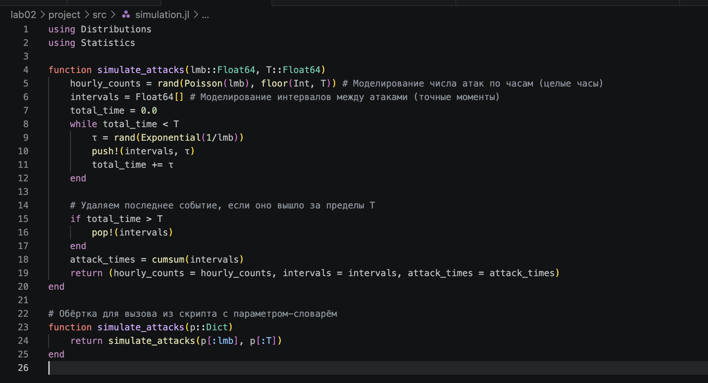
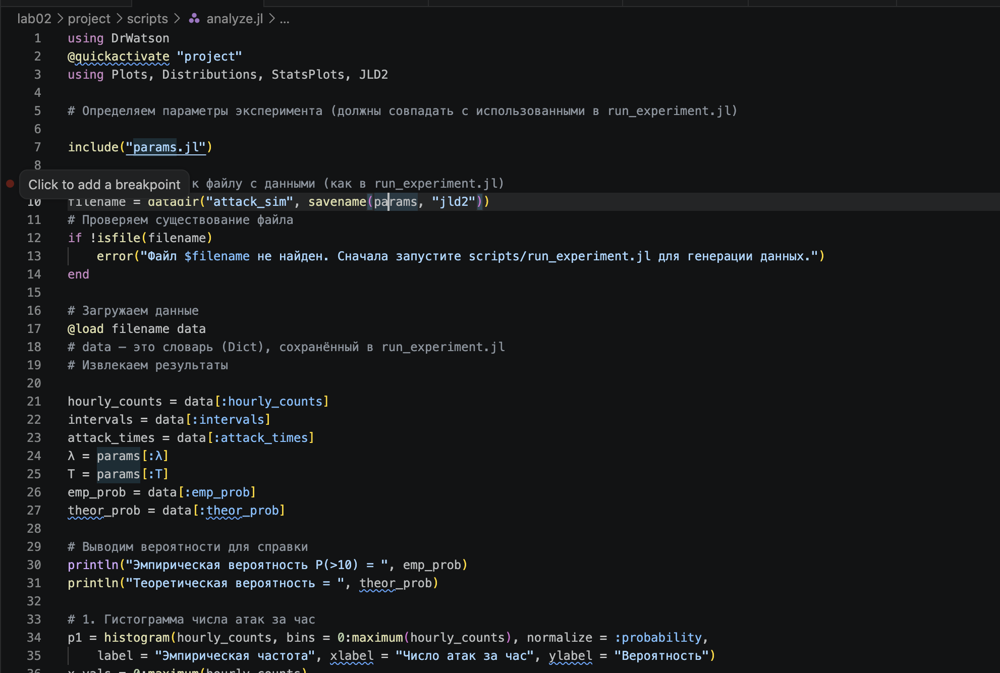
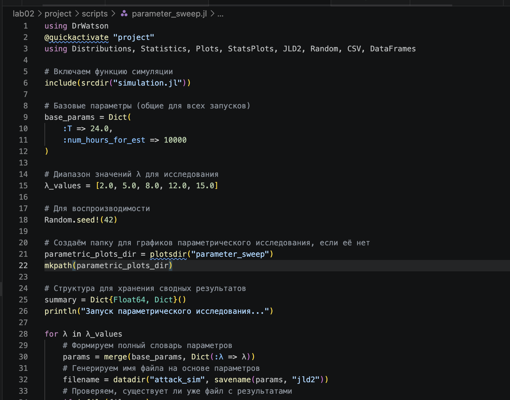

---
## Author
author:
  name: Беличева Дарья Михайловна
  degrees: DSc
  orcid: 0000-0002-0877-7063
  email: kulyabov-ds@rudn.ru
  affiliation:
    - name: Российский университет дружбы народов
      country: Российская Федерация
      postal-code: 117198
      city: Москва
      address: ул. Миклухо-Маклая, д. 6
## Title
title: Лабораторная работа №2
subtitle: Основы вероятностного моделирования угроз
license: CC BY
date: today
date-format: "YYYY-MM-DD" # Example: 2025-09-06
---

# Информация

## Докладчик

:::::::::::::: {.columns align=center}
::: {.column width="70%"}

  * Беличева Дарья Михайловна
  * студент
  * кафедра теории вероятностей и кибербезопасности
  * Российский университет дружбы народов им. П. Лумумбы
  * <https://dmbelicheva.github.io/ru/>

:::
::: {.column width="30%"}

{#fig-001 width=70%}

:::
::::::::::::::

## Цель работы

Освоить базовые методы вероятностного моделирования случайных процессов в контексте кибербезопасности.

На примере моделирования потока атак на веб-сервер изучить:

- генерацию случайных величин с заданным распределением;
- статистический анализ смоделированных данных;
- проверку соответствия эмпирического распределения теоретическому;
- оценку вероятностей редких событий;
- определить набор параметров модели (интенсивность атак, длительность наблюдения и т.д.);
- реализовать симуляцию пуассоновского потока атак;
- выполнить статистический анализ результатов;
- визуализировать данные и проверить соответствие теоретическим распределениям.

## Задание

1. Создать проект DrWatson с именем project.
2. Определить набор параметров модели (словарь params) с возможностью варьирования.
3. Написать функцию simulate_attacks(params), которая возвращает структуру с результатами симуляции (например, массив числа атак по часам, интервалы, моменты времени).
4. Использовать produce_or_load для запуска симуляции с заданными параметрами и сохранения результатов на диск.

## Задание

5. Провести серию экспериментов с разными значениями параметров (например, разные $\lambda$, разная длительность).
6. Загрузить сохранённые результаты и выполнить:
  - построение гистограммы числа атак за час и сравнение с теоретическим распределением Пуассона;
  - построение графика накопленного числа атак и интервалов между атаками;
  - проверку экспоненциальности интервалов (гистограмма, QQ-plot, возможно критерий согласия);
  - оценку вероятности события «более 10 атак за час» теоретически и эмпирически.

7. Проанализировать зависимость точности оценки вероятности от числа симуляций.

## Выполнение лабораторной работы

Представленные скрипты образуют исследовательский конвейер:

- Моделирование (simulation.jl) — вычислительное ядро.
- Генерация данных (run_experiment.jl) — получение реализаций для фиксированных параметров.
- Анализ и визуализация (analyze.jl) — проверка соответствия модели теоретическим распределениям.
- Исследование сходимости (convergence.jl) — изучение точности оценок.
- Параметрическое исследование (parameter_sweep.jl) — анализ чувствительности к изменению интенсивности

## Выполнение лабораторной работы

{#fig-001 width=70%}

## Выполнение лабораторной работы

{#fig-002 width=65%}

## Выполнение лабораторной работы

{#fig-003 width=70%}

## Выполнение лабораторной работы

{#fig-004 width=50%}

## Выполнение лабораторной работы

{#fig-005 width=60%}

## Выводы

В результате мы создали воспроизводимый скрипт для симуляции и анализа атак.

## Список литературы

1. DrWatson.jl Documentation. — URL: https://juliadynamics.github.io/DrWatson.jl/stable/ (дата обр. 26.02.2026).

2. JuliaLang. — URL: https://julialang.org/ (дата обр. 26.02.2026).

3. Literate.jl Documentation. — URL: https://fredrikekre.github.io/Literate.jl/v2/(дата обр. 26.02.2026).38
