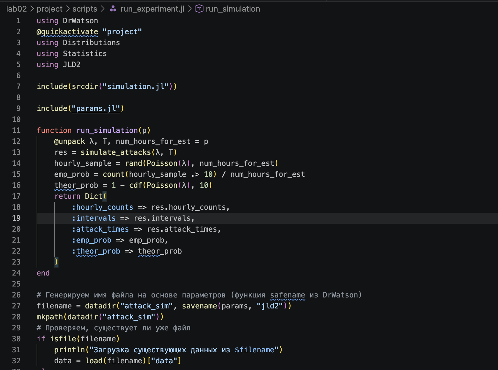
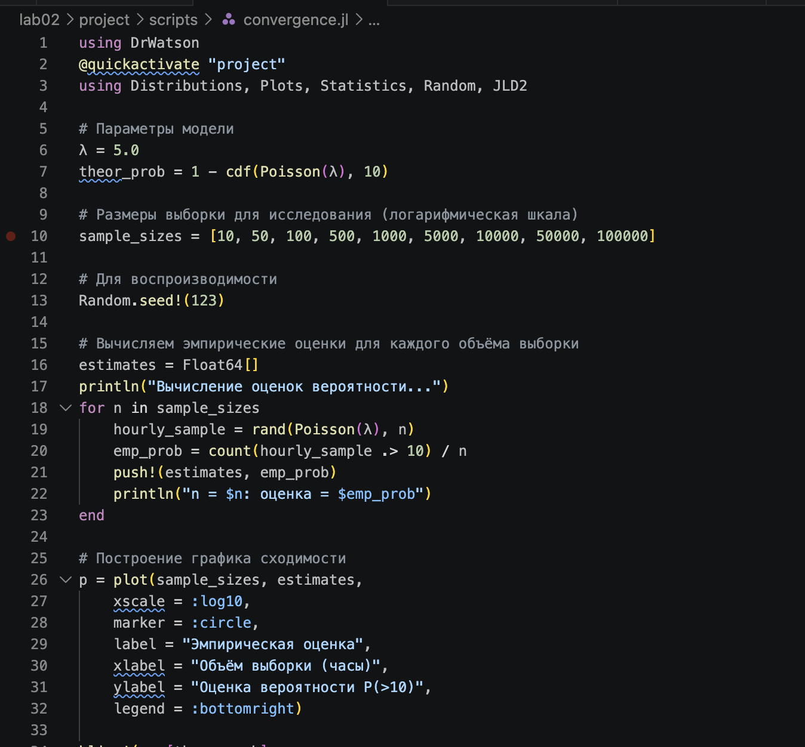

---
## Author
author:
  name: Беличева Дарья Михайловна
  degrees: BSc
  email: 1032259376@rudn.ru
  affiliation:
    - name: Российский университет дружбы народов
      country: Российская Федерация
      postal-code: 117198
      city: Москва
      address: ул. Миклухо-Маклая, д. 6

## Title
title: "Лабораторная работа №2"
subtitle: "Основы вероятностного моделирования угроз"
license: "CC BY"
---

# Цель работы

Освоить базовые методы вероятностного моделирования случайных процессов в контексте кибербезопасности.

На примере моделирования потока атак на веб-сервер изучить:
- генерацию случайных величин с заданным распределением;
- статистический анализ смоделированных данных;
- проверку соответствия эмпирического распределения теоретическому;
- оценку вероятностей редких событий;
- определить набор параметров модели (интенсивность атак, длительность наблюдения и т.д.);
- реализовать симуляцию пуассоновского потока атак;
- выполнить статистический анализ результатов;
- визуализировать данные и проверить соответствие теоретическим распределениям.

# Задание

1. Создать проект DrWatson с именем project.
2. Определить набор параметров модели (словарь params) с возможностью варьирования.
3. Написать функцию simulate_attacks(params), которая возвращает структуру с результатами симуляции (например, массив числа атак по часам, интервалы, моменты времени).
4. Использовать produce_or_load для запуска симуляции с заданными параметрами и сохранения результатов на диск.
5. Провести серию экспериментов с разными значениями параметров (например, разные $\lambda$, разная длительность).
6. Загрузить сохранённые результаты и выполнить:
  - построение гистограммы числа атак за час и сравнение с теоретическим распределением Пуассона;
  - построение графика накопленного числа атак и интервалов между атаками;
  - проверку экспоненциальности интервалов (гистограмма, QQ-plot, возможно критерий согласия);
  - оценку вероятности события «более 10 атак за час» теоретически и эмпирически.

7. Проанализировать зависимость точности оценки вероятности от числа симуляций.

# Теоретическое введение

В современных научных исследованиях важным требованием является воспроизводимость результатов вычислений. Это означает, что любой исследователь должен иметь возможность повторить вычисления и получить те же результаты, используя исходный код и данные.

Одним из подходов к обеспечению воспроизводимости является literate-программирование. Данный подход предполагает объединение программного кода и текстового описания в одном документе. Это позволяет одновременно документировать алгоритм и реализовывать его программно. В языке Julia для этого используется пакет Literate.jl, который позволяет автоматически преобразовывать исходный literate-скрипт в различные форматы, такие как обычный скрипт, Jupyter notebook и документы Quarto[@julialang; @literatejl].

Для организации структуры научного проекта используется пакет DrWatson.jl. Он обеспечивает стандартизированную структуру каталогов проекта, управление зависимостями и упрощает воспроизводимость вычислений[@drwatsonjl].

Использование инструментов Literate и DrWatson позволяет автоматизировать процесс подготовки научных отчётов, обеспечить согласованность кода и документации, а также повысить прозрачность и воспроизводимость вычислительных экспериментов.

# Выполнение лабораторной работы

Представленные скрипты образуют исследовательский конвейер:

- Моделирование (simulation.jl) — вычислительное ядро.
- Генерация данных (run_experiment.jl) — получение реализаций для фиксированных параметров.
- Анализ и визуализация (analyze.jl) — проверка соответствия модели теоретическим распределениям.
- Исследование сходимости (convergence.jl) — изучение точности оценок.
- Параметрическое исследование (parameter_sweep.jl) — анализ чувствительности к изменению интенсивности

Для выполнения работы необходимо  создать проект с помощью DrWatson. Затем создадим в этом проекте скрипт src/simulation.jl, который содержит функцию simulate_attacks, которая реализует вероятностную модель потока атак([рис. @fig-001]).

{#fig-001 width=70%}

Затем создадим скрипт scripts/run_experiment.jl. Он выполняет симуляцию с заданными параметрами, вычисляет эмпирическую вероятность события «более 10 атак за час» и сохраняет все результаты на диск([рис. @fig-002]). Скрипт предназначен для первичной генерации данных, которые потом
будут анализироваться в analyze.jl.

{#fig-002 width=70%}

Теперь создадим скрипт scripts/analyze.jl. Он загружает сохранённые данные и строит четыре диагностических графика, позволяющих визуально оценить соответствие смоделированного потока теоретическим предположениям (пуассоновости и экспоненциальности)([рис. @fig-003]). Также добавим скрипт scripts/convergence.jl([рис. @fig-004]). Он позволяет изучить, как быстро эмпирическая оценка вероятности редкого события приближается к теоретическому значению при увеличении объёма выборки.

{#fig-003 width=70%}

{#fig-004 width=70%}

Создадим скрипт scripts/parameter_sweep.jl([рис. @fig-005]). Позволяет систематически изучить, как изменение интенсивности атак влияет на характеристики потока и, в частности, на вероятность.

{#fig-005 width=70%}

1. Какими свойствами обладает простейший поток событий? Почему он часто используется для моделирования атак?

**Свойства:**

- Стационарность (вероятность событий не зависит от времени)
- Отсутствие последействия (независимость интервалов)
- Ординарность (практически невозможны два события одновременно)

Атаки часто происходят случайно во времени, независимо друг от друга, с постоянной интенсивностью.

2. Как сгенерировать реализацию пуассоновского потока на интервале времени?

```Julia
using Distributions, HypothesisTests

# Генерация на интервале [0, T]
function generate_poisson(λ::Float64, T::Float64)
    intervals = []
    t = 0.0
    while t < T
        τ = rand(Exponential(1/λ))
        t += τ
        t < T && push!(intervals, t)
    end
    return intervals
end

# Проверка экспоненциальности
function check_exponential(intervals)
    # Интервалы между событиями
    diffs = diff([0; intervals])
    # Тест Андерсона-Дарлинга
    test = ExactOneSampleKSTest(diffs, Exponential(1/mean(diffs)))
    return pvalue(test)
end
```

3. Как проверить, что интервалы между событиями распределены экспоненциально?

Для проверки гипотезы о том, что интервалы между событиями распределены экспоненциально, можно использовать несколько методов:

**Визуальные методы**

**1. QQ-plot (квантиль-квантиль график):**
```julia
using Distributions, StatsPlots

# Получаем интервалы между событиями
intervals = diff(events)

# Теоретические квантили экспоненциального распределения
λ_hat = 1 / mean(intervals)  # оценка параметра
theoretical = quantile.(Exponential(1/λ_hat), (1:length(intervals))/(length(intervals)+1))

# QQ-plot
scatter(sort(intervals), theoretical, 
        xlabel="Эмпирические квантили", 
        ylabel="Теоретические квантили",
        title="QQ-plot для экспоненциального распределения")
plot!([0, maximum(intervals)], [0, maximum(intervals)], line=:dash)  # диагональ
```

Если точки ложатся на диагональ — распределение близко к экспоненциальному.

**2. Гистограмма с наложенной теоретической плотностью:**
```julia
histogram(intervals, normalize=:pdf, bins=30, 
          label="Эмпирическая плотность", 
          xlabel="Интервал", ylabel="Плотность")
x = range(0, maximum(intervals), length=100)
plot!(x, pdf.(Exponential(1/λ_hat), x), 
      linewidth=3, label="Теоретическая плотность Exp($(round(λ_hat, digits=2)))")
```

**Статистические тесты**

**3. Тест Колмогорова-Смирнова (K-S test):**
```julia
using HypothesisTests

# Оцениваем параметр λ
λ_est = 1 / mean(intervals)

# Тест Колмогорова-Смирнова
ks_test = ExactOneSampleKSTest(intervals, Exponential(1/λ_est))
println("p-value = ", pvalue(ks_test))
```
- Если p-value > 0.05, нет оснований отвергать гипотезу об экспоненциальном распределении

**4. Тест Андерсона-Дарлинга (более чувствителен к отклонениям в хвостах):**
```julia
using Statistics

function anderson_darling_exp_test(intervals, λ_est)
    n = length(intervals)
    sorted = sort(intervals)
    F = ecdf(Exponential(1/λ_est))
    
    AD = -n - sum((2*(1:n) .- 1)/n * (log.(F.(sorted)) + log.(1 .- F.(sorted[end:-1:1]))))
    return AD
end
```

4. В чём преимущества использования DrWatson для организации вычислительного эксперимента?

- Воспроизводимость -- автоматическое сохранение параметров и seed
- Организация проектов -- стандартная структура папок
- Кэширование данных -- избежание повторных вычислений
- Управление симуляциями -- массовые запуски с разными параметрами

5. Что такое produce_or_load и как он работает?

`produce_or_load` — умное кэширование

```Julia
using DrWatson

function my_simulation(params)
    # Дорогие вычисления
    return result
end

# Первый запуск — выполнит и сохранит
result = produce_or_load("simulation", params, my_simulation)

# Второй запуск с теми же params — загрузит из кэша
result = produce_or_load("simulation", params, my_simulation)
```

6. Какая структура проекта создаётся DrWatson? Для чего нужны папки data,plots, scripts, src?
Создаваемая структура:

```
MyProject/
├── _research/        # Черновики и временные файлы
├── data/             # Данные (неизменяемые)
│   ├── sims/         # Результаты симуляций
│   ├── exp_raw/      # Сырые экспериментальные данные
│   └── exp_pro/      # Обработанные данные
├── scripts/          # Скрипты для анализа и запуска
├── src/              # Исходный код (функции, модули)
├── plots/            # Сохраненные изображения
├── Project.toml      # Список зависимостей проекта
└── Manifest.toml     # Фиксированные версии всех пакетов
```

7. Как задать набор параметров для множественных запусков в DrWatson?
Вынести их в отдельный файл. Например, script/params.jl может содержать:
```julia
default_params = Dict(
  :λ => 5.0,
  :T => 24.0,
  :num_hours_for_est => 10000
)
```
Тогда другие скрипты могут подключать этот файл (include("params.jl")) и
использовать default_params как основу, при необходимости переопределяя отдельные поля. Это улучшает поддерживаемость и уменьшает дублирование кода.









# Выводы

В результате мы создали воспроизводимый скрипт для симуляции и анализа атак.

# Список литературы{.unnumbered}

::: {#refs}
:::
