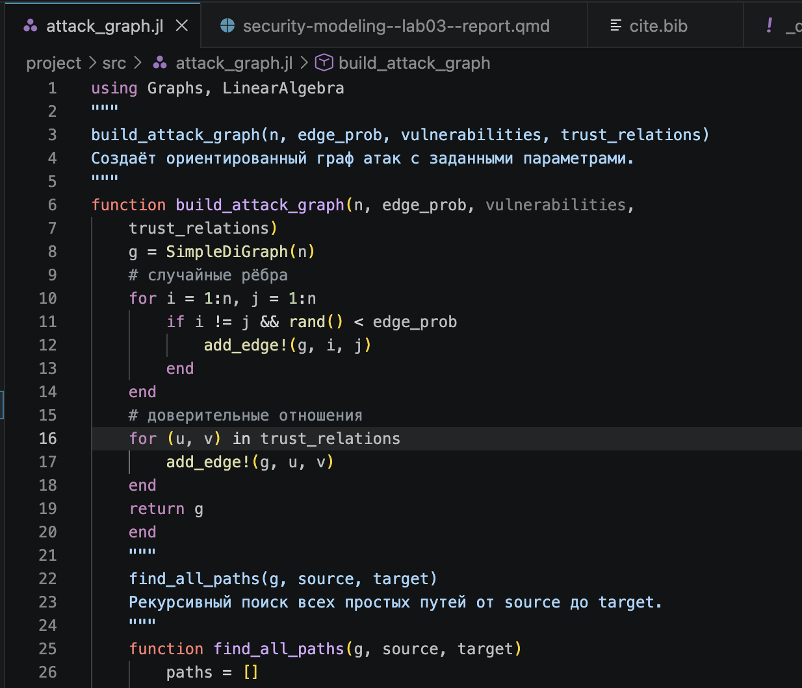
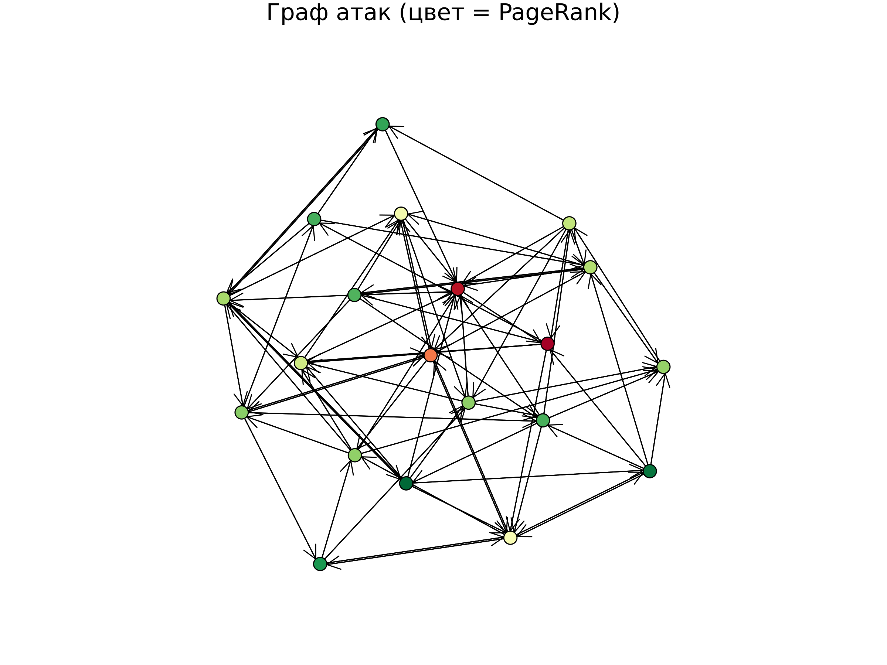
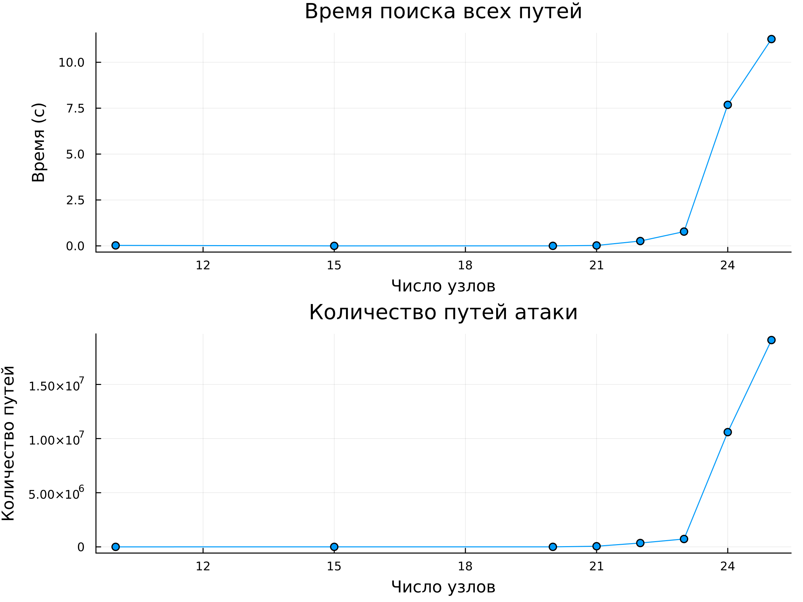
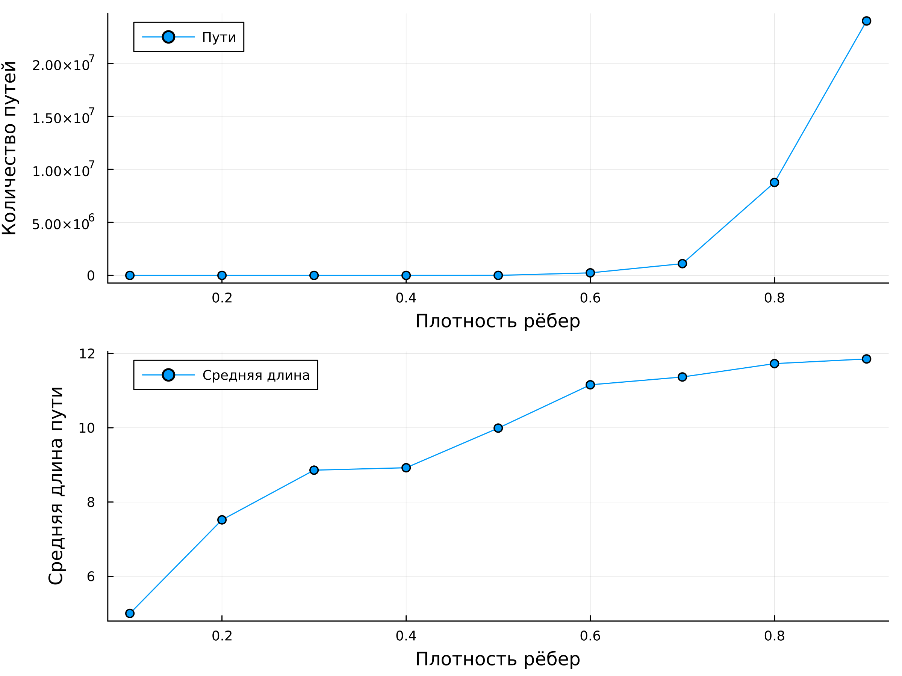

---
## Author
author:
  name: Беличева Дарья Михайловна
  degrees: BSc
  affiliation:
    - name: Российский университет дружбы народов
      country: Российская Федерация
      postal-code: 117198
      city: Москва
      address: ул. Миклухо-Маклая, д. 6

## Title
title: "Лабораторная работа №3"
subtitle: "Моделирование графов атак"
license: "CC BY"
---

# Цель работы

- Освоить методы построения и анализа графов атак для оценки уязвимостей
сетевой инфраструктуры.
- На примере моделирования атак на корпоративную сеть изучить:
  - представление сетевой топологии и уязвимостей в виде ориентированного графа;
  - алгоритмы поиска всех возможных путей атаки от начальных точек до целевых активов;
  - расчёт метрик центральности для определения критических узлов;
  - визуализацию графа с цветовой индикацией уровня риска;
  - оценку вероятности успешной атаки с учётом сложности эксплуатации уязвимостей.

# Задание

- Построить граф атак для заданной топологии сети.
- Реализовать алгоритм поиска всех путей от заданного источника к цели.
- Рассчитать метрики центральности для всех узлов и выявить наиболее критичные.
- Визуализировать граф, раскрашивая узлы в зависимости от степени риска.
- Присвоить каждому ребру вес (вероятность успешной атаки) и вычислить наиболее вероятный путь атаки.

# Теоретическое введение

В современных научных исследованиях важным требованием является воспроизводимость результатов вычислений. Это означает, что любой исследователь должен иметь возможность повторить вычисления и получить те же результаты, используя исходный код и данные.

Одним из подходов к обеспечению воспроизводимости является literate-программирование. Данный подход предполагает объединение программного кода и текстового описания в одном документе. Это позволяет одновременно документировать алгоритм и реализовывать его программно. В языке Julia для этого используется пакет Literate.jl, который позволяет автоматически преобразовывать исходный literate-скрипт в различные форматы, такие как обычный скрипт, Jupyter notebook и документы Quarto[@julialang; @literatejl].

Для организации структуры научного проекта используется пакет DrWatson.jl. Он обеспечивает стандартизированную структуру каталогов проекта, управление зависимостями и упрощает воспроизводимость вычислений[@drwatsonjl].

Использование инструментов Literate и DrWatson позволяет автоматизировать процесс подготовки научных отчётов, обеспечить согласованность кода и документации, а также повысить прозрачность и воспроизводимость вычислительных экспериментов.

# Выполнение лабораторной работы

Для начала создадим ядро моделирования графа атак, которое содержит все функции для построения ориентированного графа атак, поиска путей, расчёта метрик центральности, присвоения весов и нахождения наиболее
вероятного пути. Это основной модуль, используемый всеми скриптами ([рис. @fig-001]).

{#fig-001 width=70%}

Теперь нам нужен скрипт с однократным запуском эксперимента, который выполняет построение графа атак для заданных параметров, находит все пути, вычисляет метрики центральности, определяет наиболее вероятный путь и сохраняет результаты в JLD2-файл. Предназначен для генерации данных, которые будут анализироваться в других скриптах.



В результате получим в папке `data/attack_graph/` файл, например,
`attack_graph_λ=..._edge_prob=0.2_...jld2`. В нём хранятся:

- :graph— объект графа;
- :paths— массив всех путей;
- :metrics— словарь с метриками центральности;
- :weights— веса рёбер;
- :likely_path— массив узлов наиболее вероятного пути;
- :probability— числовая вероятность успеха.

Напишем скрипт для визуализации и анализа графа. Он загружает сохранённые данные. Строит наглядное изображение графа (с цветовой индикацией по PageRank). Выводит статистику: количество узлов, рёбер, пути, топ-5 критичных узлов по in-degree и PageRank.



Получаем визуализацию графа ([рис. @fig-002]).

{#fig-002 width=70%}

Напишем скрипт для исследования масштабируемости. Исследование, как размер сети (число узлов) влияет на время поиска всех путей и
на количество найденных путей. Позволяет оценить вычислительную сложность алгоритма.



Получим рафик convergence.png, показывающий рост времени и числа путей с увеличением сети ([рис. @fig-003]).

{#fig-003 width=70%}

Напишем скрипт для параметрического исследования. Изучает, как изменение плотности рёбер (вероятности случайного ребра) влияет
на количество путей атаки, максимальную входящую степень и среднюю длину пути.



Получим графики ([рис. @fig-004])., показывающие, как увеличение связности графа (плотности) приводит к росту числа путей и их средней длины.

{#fig-004 width=70%}

## Контрольные вопросы

1. Граф атак -- направленный граф возможных действий злоумышленника для достижения цели. Вершины — состояния системы, рёбра -- переходы через уязвимости. Используется для оценки защищённости, выявления маршрутов атак, расчёта метрик опасности, анализа рисков и расследования инцидентов.

2. Для поиска путей в графах атак применяются различные алгоритмы, например: BFS (кратчайший путь), Дейкстра (взвешенные графы), A* (с эвристикой), Беллман–Форд (отрицательные веса), Флойд–Уоршелл (все пары вершин). Веса рёбер могут отражать сложность или вероятность успеха атаки.

3. Метрики центральности определяют важность узлов в графе. 
  * In-degree -- число входящих рёбер (указывает на частоту атак на узел). 
  * PageRank -- учитывает важность связанных узлов (показывает влияние на распространение угроз).

4. Вероятность успешной атаки оценивается через произведение весов рёбер на пути (вероятности успеха перехода). Для поиска наиболее вероятного пути используют модифицированный алгоритм Дейкстры или A*. Сложные модели — байесовские графы атак.

5. Ограничения модели: масштабируемость (экспоненциальный рост числа путей), неопределённость данных, динамичность сетей, сложность с циклами и защитными механизмами, высокие вычислительные затраты.

6. Учёт защитных механизмов (например, МЭ): добавление узлов/рёбер защиты, условные переходы (блокировка → обнуление веса), атрибуты правил фильтрации, вероятностные модели (шанс обнаружения), интеграция конфигураций правил доступа и многоуровневые модели безопасности.

# Выводы

В результате данной лабораторно работы освоены методы построения и анализа графов атак для оценки уязвимостей сетевой инфраструктуры, а также выполнен пример моделирования атак на корпоративную сеть.

# Список литературы{.unnumbered}

::: {#refs}
:::
