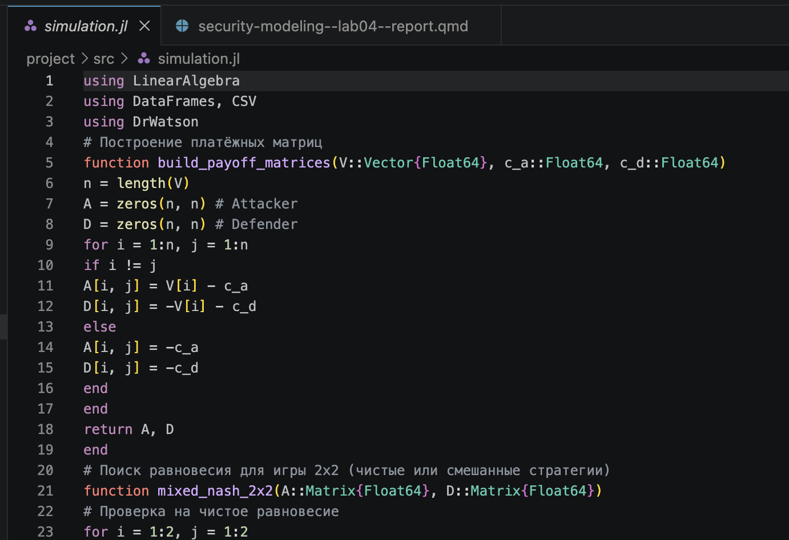
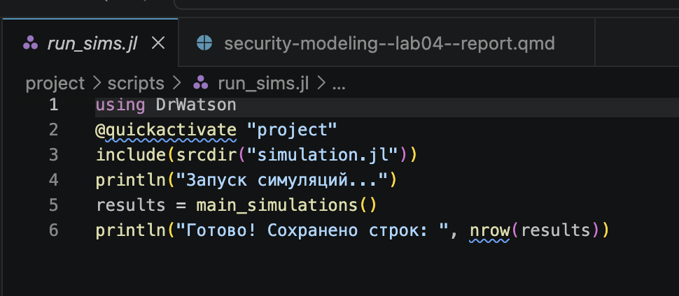
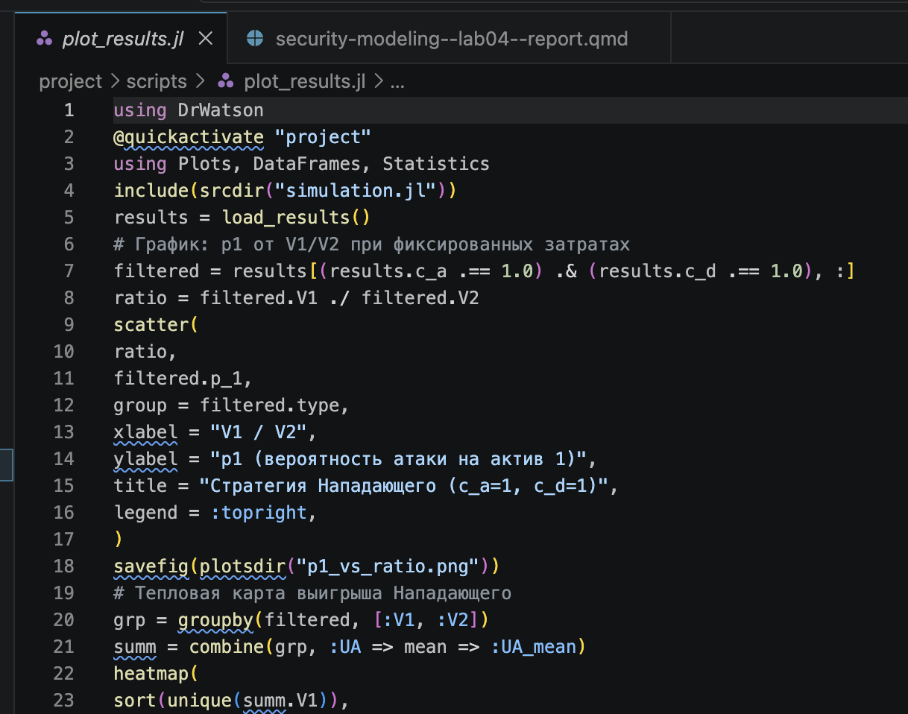

---
## Author
author:
  name: Беличева Дарья Михайловна
  degrees: BSc
  affiliation:
    - name: Российский университет дружбы народов
      country: Российская Федерация
      postal-code: 117198
      city: Москва
      address: ул. Миклухо-Маклая, д. 6
## Title
title: Лабораторная работа №4
subtitle: Моделирование конфликта «Защитник–Нападающий»
license: CC BY
date: today
date-format: "2026-05-30" # Example: 2025-09-06
---

# Информация

## Докладчик

:::::::::::::: {.columns align=center}
::: {.column width="60%"}

  * Беличева Дарья Михайловна
  * студент
  * кафедра теории вероятностей и кибербезопасности
  * Российский университет дружбы народов им. П. Лумумбы
  * <https://dmbelicheva.github.io/ru/>

:::
::: {.column width="30%"}

{#fig-001 width=60%}

:::
::::::::::::::

## Цель работы

Освоить применение теории игр для анализа противостояния в сфере информационной безопасности. Научиться строить матричную игру, находить равновесие Нэша в чистых и смешанных стратегиях.

**Задание**

- Формализовать конфликт «Защитник–Нападающий» в виде антагонистической игры.
- Реализовать на Julia функции расчёта платёжной матрицы, поиска равновесия Нэша и симуляции игры.
- Визуализировать зависимость ожидаемого выигрыша и равновесных вероятностей от стоимости защиты и величины ущерба.

## Выполнение лабораторной работы

{#fig-001 width=70%}

## Выполнение лабораторной работы

{#fig-002 width=70%}

## Выполнение лабораторной работы

{#fig-003 width=50%}

## Выполнение лабораторной работы

{#fig-004 width=70%}

## Выполнение лабораторной работы

{#fig-005 width=60%}

## Выполнение лабораторной работы

1. Если **активы почти одинаковы** по ценности → Нападающий атакует случайно (50/50), Защитник тоже случайно защищается → **смешанное равновесие**.
2. Если **один актив заметно дороже** → Нападающий всегда атакует дорогой, Защитник всегда защищает дорогой → **чистое равновесие**.
3. Тепловая карта показывает: в смешанном равновесии выигрыш Нападающего **ниже** (всего ~10–12), чем в чистых углах (~17.5), где он грабит дорогое, а защищают дешёвое.

## Выводы

На Julia созданы функции расчёта платёжной матрицы, поиска равновесия Нэша и симуляции игры для формализации конфликта «Защитник–Нападающий» в виде антагонистической игры. Визуализированы зависимость ожидаемого выигрыша и равновесных вероятностей от стоимости защиты и величины ущерба

## Список литературы

1. DrWatson.jl Documentation. — URL: https://juliadynamics.github.io/DrWatson.jl/stable/ (дата обр. 30.05.2026).

2. JuliaLang. — URL: https://julialang.org/ (дата обр. 30.05.2026).

3. Literate.jl Documentation. — URL: https://fredrikekre.github.io/Literate.jl/v2/ (дата обр. 30.05.2026).